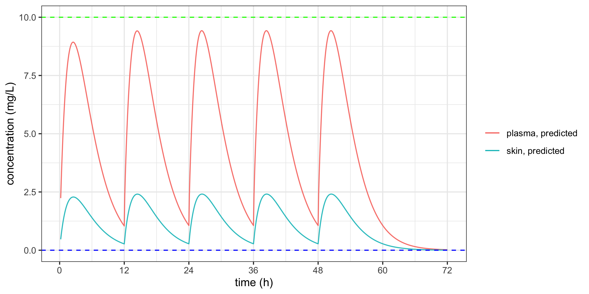

# Physiological based pharmacokinetic modeling and simulation for the distribution of tranexamic acid in human

## Goal

The goal of this Physiological based pharmacokinetic (PBPK) modeling and simulation exercise is to understand the factor that impact tranexamic acid (TXA) distribution in human. In particular, the distribution of TXA distribuition in skin after oral intake of the drug. I would like to know more under the dosing regimen of Transino II (by Daiichi Sankyo Healthcare, which aims to treat melasma), how TXA would distribute and the exposure comparison between different organs

Note this is purelu a modeling and simulation (M&S) exercise. The result should be taken with a healthy dose of skeptism, and should not be used for medical advice. 

## Set up

The simulation is run with Rstudio (version) and the following packages (version) ....

- tidyverse
- mrgsolve
- mrggsave
...

## Model Development

The PBPK model is borrowed from [Utsey et al., 2020](https://dmd.aspetjournals.org/content/48/10/903) with an additional compartment added to model TXA absoption with first-order kinetics. Additional drug property related to TXA is obtained from its [PubChem page](https://pubchem.ncbi.nlm.nih.gov/compound/Tranexamic-acid).

The base model is built with following assumptions: 
- All drug in the plasma is unbound 
- blood:plasma ratio = 3
- TXA adsoption rate in the gut lumen = 0.4 h-1

To validate the model, we use the observed data from [Pilbrant et al., 1981](https://pubmed.ncbi.nlm.nih.gov/7308275/) with both IV and oral observed data from 3 healthy male wolunteers. I conclude the (parameters) provide a reasonable fit, and the pharmacokinetics is overall inline with what is described in [Dunn 1999](https://pubmed.ncbi.nlm.nih.gov/10400410/) and I will be using them for the following simulation. 

## Oral dosing from Transino II

The recommended oral dosing of Transino II roughlt translated into 1.5g of TXA per 12 hour. The simulation result is provided as follows. The blue line on the left indicate the Kd of TXA binding to plasminogen [Dunn 1999](https://pubmed.ncbi.nlm.nih.gov/10400410/), the blue line on the right indicates effective TXA concentration to inhibit fibrinolysis [Picetti et al., 2019](https://www.ncbi.nlm.nih.gov/pmc/articles/PMC6365258/). The simulation predicts that the TXA concentation in the skin will be somewhat effective in inhibiting pigment forming for at least 12 hours, but the concentration in plasma is unlikely to inhibit the breakdown of blood clot. 

5 dose of oral TXA for every 12 hours over 3 days is simulated. Multiple dose leads to slightly higher Cmax of TXA human, but with almost no impact on Tmax, or the time of exposure. 

In addition, after TXA dosing stopped, all the TXA is cleared from plasma and skin in 24 hours. 

## Sensitivity Analysis

### Blood:plasma ratio

The main reason for conducting blood:plasma ratio is due to the parameter is assumed, and my fitted result is different from [Kane et al., 2021](https://pubmed.ncbi.nlm.nih.gov/34087356/). 

(add pic)

### Absorption rate

I want to carry out the senseitivity analysis on TXA absoprtion rate not only because this parameter is assumed in the current model, but also [Dunn 1999](https://pubmed.ncbi.nlm.nih.gov/10400410/) reported a slightly different bioavailability in the with/ without food situation. 

(add pic)

### Body weight & gender

The interest in body weight is partially based on the validation data are from heavier males, while small females may also take this drug...

### Renal Impairment

Since TXA is mostly cleared through renal pathway, thus ...

## Conclusion and Discussion

Overall, the plasma concentraion following the Transino II recommended dosing scheme would lead to safe plasma TXA concentration with no apparent risk of clotting ...

We acknowledge the science behind our work isn't new, as [Kane et al., 2021](https://pubmed.ncbi.nlm.nih.gov/34087356/) published a similar study on TXA with more extensive discussion on different route of administration. But I concede this repo provides an open-source implementation is is beneficial for the science. 

## Content of the folder

folders: 

- TranexamicAcidPBPK.cpp (model file)

- doc (where reference papers are stored)
